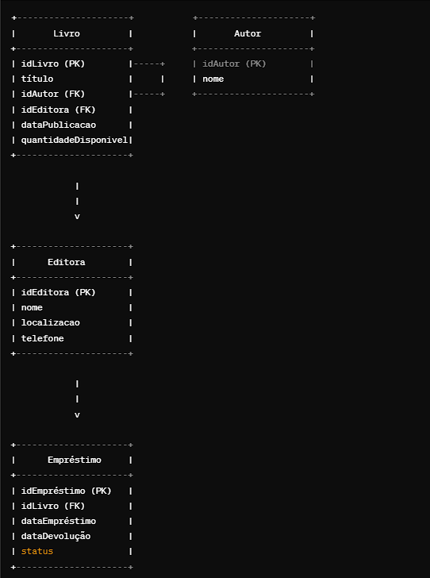
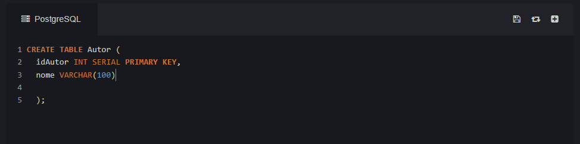
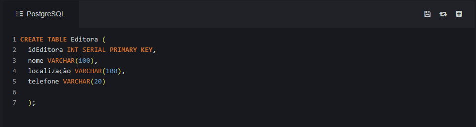
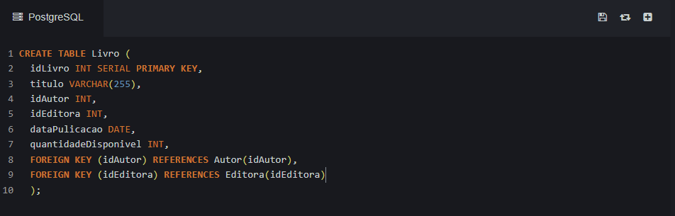
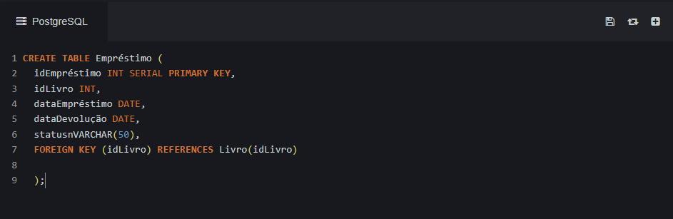
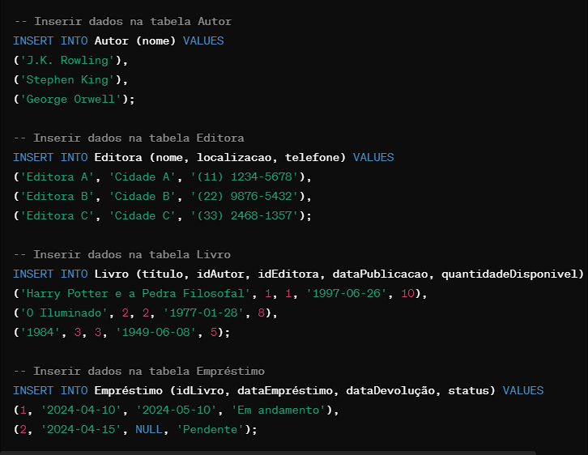
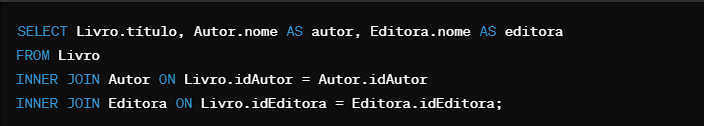
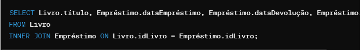

 

•	Cada entidade é representada por um retângulo, onde o nome da entidade está no topo.
•	Os atributos de cada entidade são listados dentro do retângulo, com a chave primária (PK) em negrito.
•	As linhas conectando as entidades representam os relacionamentos entre elas. Por exemplo, um livro está relacionado a um autor através do campo idAutor.
•	Os relacionamentos são indicados pelas chaves estrangeiras (FK) em uma entidade que referenciam a chave primária em outra entidade.

1.	Tabela Autor:
•	idAutor (Chave Primária)
•	nome
 
 

2.	Tabela Editora:
•	idEditora (Chave Primária)
•	nome
•	localizacao
•	telefone																							

 

3.	Tabela Livro:
•	idLivro (Chave Primária)
•	título
•	idAutor (Chave Estrangeira referenciando Autor)
•	idEditora (Chave Estrangeira referenciando Editora)
•	dataPublicacao
•	quantidadeDisponivel

 

4.	Tabela Empréstimo:
•	idEmpréstimo (Chave Primária)
•	idLivro (Chave Estrangeira referenciando Livro)
•	dataEmpréstimo
•	dataDevolução
•	status

 
Teste na Tabela:
Dados de teste nas tabelas que criamos anteriormente para simular um ambiente básico de um sistema de gerenciamento de biblioteca. Vou adicionar alguns autores, editoras, livros e alguns registros de empréstimo.

 

5.	Comando para Listar todos os livros com seus respectivos autores e editoras:

 

6.	Listar os livros emprestados e seus dados de empréstimo:

 

7.	Listar todos os autores e a quantidade de livros que cada um escreveu:
 

8.	Listar todos os livros publicados por uma editora específica (vamos supor que queiramos listar os livros publicados pela Editora A, podia ser qualquer Editora B, C e etc):
 
